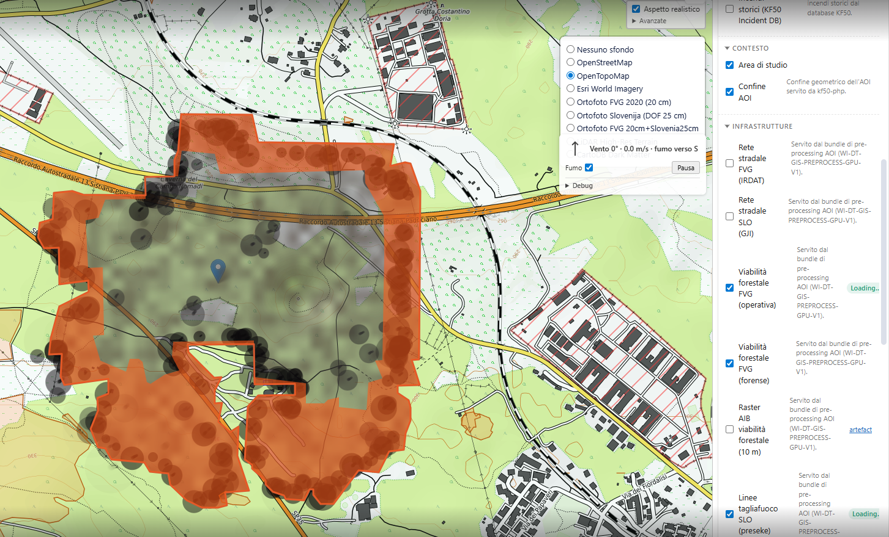
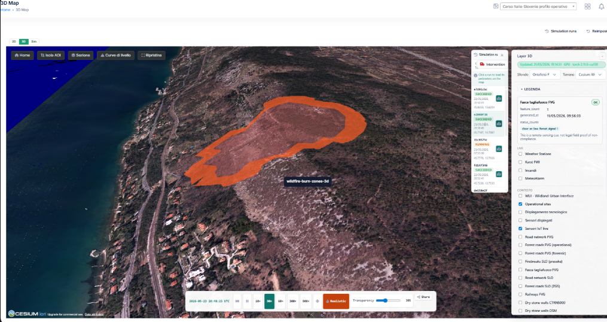

# PyroWISE

> A modern Python wildland-fire-growth engine for the Karst — operational scientific simulator behind the [Karst Firewall 5.0](https://github.com/infordata-sistemi/karst-firewall-50) digital twin, calibrated for the IT/SI cross-border region and designed to scale to other AOIs.

PyroWISE is the fire-spread simulator at the heart of the [TerraWise](https://github.com/infordata-sistemi/terrawise) platform. It propagates a fire perimeter on a continuously-updated digital twin of the terrain (fuel × wind × slope × barrier × moisture × topography) and produces operational nowcasts, scenarios and replays — perimeters, ensemble envelopes, arrival-time rasters and per-run audit bundles — that civil-protection teams use for situational awareness, intervention planning, and post-event evidence workflows.

This repository is the **public scientific documentation** for PyroWISE. It describes what the engine does, the canonical methods it builds on, what it can claim (and what it can't), how it is validated, and the boundary between the open science and the commercial product. **The engine itself is not open**; the methods, validation protocol, published findings and citation are.

**PyroWISE is a commercial product of Infordata Sistemi Srl SB.** The open-vs-commercial boundary is explicit and in writing — see [OPEN_VS_COMMERCIAL.md](OPEN_VS_COMMERCIAL.md).

---

## What PyroWISE is

PyroWISE is a pure-Python, GIS-native, AI-augmented wildland-fire-growth service. It reimplements the public, peer-reviewed **CFFDRS** science stack for modern Python, containers, FastAPI and OGC-friendly GIS artefacts, while keeping the peer-reviewed foundations explicit and citable per equation. The codebase is a **clean-room reimplementation** of public science — it does not vendor or copy source from any third-party simulator (see ADR-001 rationale on not vendoring WISE / Prometheus directly: deprecated C++ / Microsoft COM core, hard to deploy alongside modern Python ML pipelines).

What it gives an operator *and* a scientist:

- **Nowcast, scenario, and replay simulations** over a heterogeneous fuel × wind × slope × barrier field. Outputs: perimeters, ensemble envelopes (p10 / p50 / p90 plus burn-probability), arrival-time COGs, and run bundles with full provenance (manifest, weather provenance, AOI profile, barrier policy, AI usage, fuel classes touched, downgrade and fallback flags).
- **Calibrated Karst envelope** for the cross-border region with versioned priors and a single resolver entry point so production routing is auditable and reproducible.
- **Cross-border data layer** — bilateral DTM and CHM, infrastructure (roads, railways, firebreaks), dry-stone-wall cadastres (FVG CTRN + SLO RUBIN + OSM), hydrography with barrier tagging, conservation overlays with a restoration traffic-light policy, and a canonical 1990–2026 cross-border fire registry — all served from one AOI catalogue contract.
- **Operator HTTP API** with async simulation, ensemble fan-out, live Server-Sent-Events perimeter streaming, time-to-impact for points / lines / polygons, structured error codes and Prometheus metrics. Designed to drop in behind any HTTP + GeoJSON / PMTiles / COG client (Cesium, Leaflet, QGIS workflows, civil-protection cockpits).
- **Decision-support surfaces** that wrap the kernel without modifying it — OSINT bus, cross-source ignition correlator, wildfire-smoke PM2.5 dispersion COGs (currently `UNCALIBRATED`, see below), sensor ingest (e-nose / LDT / LoRa). A run with OSINT visible is the **same physics** as a run without it — none of these surfaces silently alters wildfire priors or the kernel.

---

## Scientific basis

PyroWISE preserves the peer-reviewed Canadian Forest Service science **unchanged**, and then layers on Karst-specific calibration and modern engineering:

| Component | Reference |
|---|---|
| **Fire Weather Index (FWI) System** | Van Wagner, C. E. (1987). *Development and structure of the Canadian Forest Fire Weather Index System*. Canadian Forestry Service Forestry Technical Report 35. Plus the FWI 2025 / CFFDRS2025 NRCan update. |
| **Fire Behavior Prediction (FBP) System** | Forestry Canada Fire Danger Group (1992). *Development and structure of the Canadian Forest Fire Behavior Prediction System*. Information Report ST-X-3. 16 canonical fuel types. |
| **Huygens vector propagation** | Tymstra, C., Bryce, R. W., Wotton, B. M., Taylor, S. W. & Armitage, O. B. (2010). *Development and Structure of Prometheus: the Canadian Wildland Fire Growth Simulation Model*. NRCan Information Report NOR-X-417. |
| **Rothermel surface fire model (for cross-comparison)** | Rothermel, R. C. (1972). *A mathematical model for predicting fire spread in wildland fuels*. USDA Forest Service Research Paper INT-115. |
| **Smoke / atmospheric dispersion** | NOAA HYSPLIT (Stein et al. 2015, BAMS). Driving meteorology: NCEP GFS / NAM; CAMS as the EU PM2.5 cross-reference. |

AI augmentation (U-Net spread emulator, transformer ensemble surrogate, LLM scenario narrator) is layered on top, with the **physics kernel always available as fallback and as ground truth** — so a peer-review-friendly run is always one config flag away from a production AI-augmented one.

See [MODEL.md](MODEL.md) for a fuller methodological summary.

---

## Scientific findings — current highlights

> Detailed paper-grade findings live in the project's append-only scientific-findings log, with append-only audit trail. Below are the *published* highlights that practitioners, paper reviewers and external benchmarkers should know about today.

### 1. Karst K-class fuel taxonomy as a citable contribution

PyroWISE introduces a **9-class Karst envelope set (`K01..K09`)** that adapts FBP physics to Dinaric / NE-Italy Karst vegetation — black-pine plantations, abandoned grasslands, dry-stone-wall mosaic, oak-hornbeam regeneration. The classes are *envelopes over the canonical FBP fuel types*, not replacements, so the science is upward-compatible with downstream CFFDRS reimplementations. A 5-grid resolver fuses species × structure × age × moisture × continuity inputs into the active FBP envelope per pixel.

This is a publication-relevant scientific contribution; the class definitions and the crosswalk to canonical FBP types are part of the open methodology and will be published in the companion paper.

### 2. Polygon-only Huygens calibration line — methodological invention

Calibration of the Karst envelope is run as a **polygon-only Huygens loop** (`use_burn_raster=False`) with **CMA-ES** as the default optimiser (Nelder-Mead with top-K grid priming as the secondary backend). The polygon-only path is more numerically stable than the burn-raster path under repeated cleanup, makes the optimiser hard-reject timeout-biased evals, and is the production calibration path for the cross-border Karst priors. The methodology (composite `geo + time + severity + fuel` loss, simulator-agnostic optimiser adapter, audit-grade run manifest) is open and will be documented in the companion paper.

### 3. Calibrated cohort-mean IoU on the cross-border Karst

| Cohort | Cohort-mean IoU | Method | Note |
|---|---|---|---|
| **Karst K04 cross-border** (IT / FVG / SLO) | **0.39 – 0.41** | CMA-ES calibrated priors over the registry cohort, replayed with historical weather and observed-perimeter ground truth | **Structural calibration ceiling**, not an optimiser ceiling — see (4) |
| **FVG Karst-plateau** | **0.41** | 3-event CMA on a 10 m operational fuel mosaic over SE Karst | Plateau scope only; alpine FVG deferred (no anemometer station coverage in the Carnic stations) |
| **No-calibration free-burn baseline** *(transferability stress only)* | ~0.25 – 0.27 | Same kernel, no calibrated priors — used **only** to put PyroWISE and external comparators on the same un-tuned footing | Not a production accuracy claim |

**Honesty boundary.** The calibrated cohort IoU (≈ 0.39 – 0.41) is the production-relevant accuracy. The no-cal baseline IoU (≈ 0.25 – 0.27) is *not* PyroWISE's accuracy — it is a deliberately un-tuned free-burn baseline used only for external-comparator transferability stress (see §"Benchmarking" below). State-of-the-art operational wildfire simulators on real multi-day fires sit at IoU ≥ 0.5 only for the best-conditioned events; the Karst's cold-season convective regime + sparse anemometer coverage place a real floor on what a single global prior can achieve, which is exactly the (4) finding.

### 4. K04 calibration ceiling is *structural*, not an optimiser limit

The cohort-mean IoU plateau in the high 0.3s / low 0.4s is a **structural Pareto conflict between event regimes** (summer convective vs cold-season vs wind-driven), not optimiser convergence failure. Another single-prior CMA campaign will not move it; the way forward is a **regime-aware priors router** that picks the right envelope per (season, weather regime, fuel class) at run time. This is documented as the next published lever.

A first ablation of the (duration, summer, Bora-wind) classifier was **refuted** by the registry cohort (the LOW-ROS-WIND-DOMINATED cluster is a mixture, not a clean axis). This is a first-class negative result — paper-relevant because it tells external benchmarkers which directions *don't* work, not just which directions do.

### 5. Cold-season wind coupling is partly fuel-error in disguise

Cold-season IT-only refits corroborate that the wind-coupling axis acts as a **proxy for under-modelled leafless-state fuels** — the wind multiplier rises to absorb fuel-side error that should live in a `curing_frac` / dynamic-fuel-state surface. Production routing is unchanged pending a fuel-side fix; the wind-side calibration is the wrong lever. Another paper-grade negative result.

### 6. Smoke dispersion is end-to-end but `UNCALIBRATED`

The HYSPLIT-backed `smoke_concentration.tif` pipeline runs on the 4-fire Karst cohort and produces a Gaussian-puff COG, but with uniform meteorology and current emission factors it saturates at FB = −2.0 / FAC2 = 0.0 — the emitted PM2.5 mass is orders of magnitude too low against measured EMSR601 ground truth. The artefact is shipped with an explicit **`UNCALIBRATED`** tag and should be read as a **visual-shape preview**, not a concentration estimate. The boundary is stated up front so operators don't quote it as PM2.5 and reviewers don't mistake it for a calibrated dispersion claim.

### 7. Honest dt invariance — fixed-step in production

Polygon-only Huygens is dt-stable at small-fire scale but is **dt-sensitive at large-event scale** (cleanup / preserve lock-in plus large-dt CFL overshoot). Production runs are frozen at a fixed `dt` per AOI profile; adaptive-dt is a separately authorised regime that requires its own refit — it is **not** silently enabled against the production priors. This protects external reproducibility: a paper benchmark run that hands you the same `dt` will produce the same perimeters.

### 8. Cross-border canonical fire registry (1990–2026, 6 039 events)

PyroWISE compiles and uses a **canonical IT/SI Karst fire registry** spanning 1990–2026 (~6 000 events), reconciled across the A.R.D.I. FVG archive, the SLO ZGS *gozdni požari* registry, and Copernicus EMS rapid-mapping perimeters. The registry methodology — duplicate resolution, attribute reconciliation, perimeter source ranking, EO-progression tier ladder (Tier 0 → Tier 4) — is itself a publication-relevant infrastructure contribution. A subset of the registry is being prepared for open CC BY 4.0 release alongside the companion publication.

---

## Benchmarking — external comparators, on the same footing

PyroWISE is benchmarked two ways, both against **observed** fire perimeters (Copernicus EMS / WFIGS / MTBS), using **one shared metric code path** (IoU, Hausdorff, signed area error, symmetric difference) so every published number is directly comparable.

1. **External-comparator scorecards** — a *no-calibration* PyroWISE baseline and an out-of-process external engine are each scored against the same observed perimeter with the same inputs (fuel crosswalk, weather, ignition). These are **transferability stress evidence**, not calibration or production-default evidence: a no-cal free-burn model over-spreads, so the absolute fidelity is low by design.
2. **Calibrated in-domain cohorts** — the production-grade number (above): PyroWISE with calibrated Karst priors replayed across the registry cohort.

**Discipline:** PyroWISE never imports or runs the external engine directly. The comparator handoff is a **file boundary** — PyroWISE writes inputs the external engine consumes, the external engine writes outputs PyroWISE scores. This keeps the comparison auditable and protects against accidental cross-pollination.

### External-comparator scorecards

| Benchmark event | Metric | PyroWISE (no-cal baseline) | External engine | Note |
|---|---|---|---|---|
| **Dixie megafire** (US-CA, 2021; 963 k ac) | IoU | **0.27** | Cell2Fire **0.25** | Comparable IoU via *opposite* spread biases — PyroWISE over-spreads at full horizon, Cell2Fire under-spreads at the 20-day cap |
| _(30 m / 75 d free-burn vs 120 m / 20 d bounded Cell2Fire)_ | signed area error | +2.7 (×3.7 over) | −0.5 (under) | Cell2Fire closer to 0, PyroWISE further |
|  | Hausdorff (m) | 62 936 | 64 311 | comparable |
| **CFSDS Nadina** (CA-BC, 2018) | IoU | 0.0 (mask-aware) | Cell2Fire 0.03 | Both low absolute fidelity — benchmark transferability evidence, not production |

**Important caveat on the Dixie comparator.** A full-resolution, full-horizon Cell2Fire replay of the Dixie megafire is *computationally infeasible*: the canonical engine overflows two hardcoded fixed-size arrays ~12× on the 20 M-cell / 1 780 h Dixie inputs and is super-linear in weather periods. The Cell2Fire column above is therefore a **bounded run** (120 m downsample, 20-day cap, patched engine) — published transparently as bounded transferability evidence, **not** a full-fidelity comparison. This is a paper-grade finding in its own right: practitioners benchmarking on continental megafires need to know about this engine-side limit.

---

## External systems we connect to

This section is the equivalent of a paper's *Methods → Data sources* — every external dataset, satellite product or service PyroWISE consumes or benchmarks against, with citation links so a reproducer can find the same sources.

### Fire growth simulators we reference and compare against

| System | Role | Reference |
|---|---|---|
| **WISE / Prometheus** (Canadian Forest Service) | Reference implementation of the CFFDRS science we reimplement. File-boundary external comparator for benchmark events. | [firegrowthmodel.ca/prometheus](https://firegrowthmodel.ca/prometheus/overview_e.php) · [WISE-Developers GitHub](https://github.com/WISE-Developers) |
| **Cell2Fire** (Pais et al. 2019) | Stochastic, cell-based comparator. Scored against PyroWISE on Nadina and Dixie. | [github.com/cell2fire/Cell2Fire](https://github.com/cell2fire/Cell2Fire) |
| **FARSITE / FlamMap / BehavePlus** (USDA / Missoula Fire Sciences Lab) | US-side comparators; reference for fuel models and Rothermel. | [firelab.org](https://www.firelab.org/) |
| **CFFDRS science** (NRCan / Canadian Forest Service) | The peer-reviewed FWI / FBP / Huygens foundations we reimplement. | [github.com/cffdrs](https://github.com/cffdrs) |

### Smoke and atmospheric dispersion

| System | Role | Reference |
|---|---|---|
| **NOAA HYSPLIT** | Trajectory + dispersion model behind PyroWISE's optional `smoke_concentration.tif` Gaussian-puff COG. | [ready.noaa.gov/HYSPLIT.php](https://www.ready.noaa.gov/HYSPLIT.php) |
| **NOAA NCEP GFS / NAM** | Meteorological forcing fields for HYSPLIT runs and ensemble seeding. | [nomads.ncep.noaa.gov](https://nomads.ncep.noaa.gov/) |
| **Copernicus Atmosphere Monitoring Service (CAMS)** | EU-side aerosol / PM2.5 reference for calibration of the smoke product. | [atmosphere.copernicus.eu](https://atmosphere.copernicus.eu/) |

### Weather, fuel and ground-truth feeds

| System | Role | Reference |
|---|---|---|
| **ARPA FVG OSMER** | Italian regional meteorological observations and forecast (hourly). | [osmer.fvg.it](https://www.osmer.fvg.it/) |
| **ARSO** | Slovenian Environment Agency — meteorology (30 min), DMR1 LiDAR DTM, GKOT LAZ tile pack, conservation overlays. | [meteo.arso.gov.si](https://meteo.arso.gov.si/) · [arso.gov.si](https://www.arso.gov.si/) |
| **Open-Meteo** | Reanalysis / public forecast feed used by comparator workflows when authoritative station coverage is sparse. | [open-meteo.com](https://open-meteo.com/) |
| **Copernicus C3S / ERA5 (CDS)** | Reanalysis-grade weather for hindcasts, calibration and out-of-sample validation. | [cds.climate.copernicus.eu](https://cds.climate.copernicus.eu/) |
| **EUMETSAT LSA-SAF (FRP)** | Geostationary fire radiative power timelines (MSG-SEVIRI) for ground-truth ingest. | [landsaf.ipma.pt](https://landsaf.ipma.pt/) |
| **NASA FIRMS** | Active-fire detections (MODIS / VIIRS) feeding the active-fire trigger hook + EO progression factory. | [firms.modaps.eosdis.nasa.gov](https://firms.modaps.eosdis.nasa.gov/) |
| **Copernicus EMS** | Rapid-mapping perimeters (EMSR-coded) as polygon ground truth. | [emergency.copernicus.eu](https://emergency.copernicus.eu/) |
| **Sentinel-2 (ESA Copernicus)** | dNBR / RdNBR / BAIS2 burn-severity rasters as severity ground truth. | [sentinel.esa.int](https://sentinel.esa.int/web/sentinel/missions/sentinel-2) |
| **A.R.D.I. FVG** (IUAV) | Italian regional wildfire archive — 1 853 Karst-IT fires, reconciled into the canonical registry. | (regional access) |
| **IRDAT FVG / Eagle FVG** | Italian regional 1 m LiDAR DTM + CHM source. | [irdat.regione.fvg.it](https://irdat.regione.fvg.it/) |
| **OpenStreetMap** | Roads, railways, motorway / trunk class tagging for the tiered barrier policy. | [openstreetmap.org](https://www.openstreetmap.org/) |

### Operations, conservation and OSINT

| System | Role | Reference |
|---|---|---|
| **Natura 2000** (EEA / Copernicus) | Conservation cross-border layer driving the restoration traffic-light policy. | [eea.europa.eu/themes/biodiversity/natura-2000](https://www.eea.europa.eu/themes/biodiversity/natura-2000) |
| **ZGS** (Zavod za gozdove Slovenije) | SLO firebreak cadastre + *gozdni požari* historical fire registry. | [zgs.si](https://www.zgs.si/) |
| **ZRC SAZU** | Scientific collaborator on cross-border CHM / burn-area mapping. | [zrc-sazu.si](https://www.zrc-sazu.si/) |
| **AIS** (vessel tracking) + **ADS-B** (aircraft tracking) | OSINT operations layer feeding the cross-source ignition correlator. | open feeds |
| **MeteoAlarm** | EU severe-weather warning bus consumed by the trigger hook. | [meteoalarm.org](https://meteoalarm.org/) |

---

## How PyroWISE plugs into the operator

PyroWISE is the **growth simulator**. It does *not* answer "where is a fire likely to start?" — that's the job of [`kf50-kfwi-api`](https://github.com/infordata-sistemi/kf50-kfwi-api) (the Karst Fire Weather Index ignition + severity service). They are independent: PyroWISE consumes KFWI severity only as a display overlay, never as a calibration input to the wildfire kernel.

In the [Karst Firewall 5.0](https://github.com/infordata-sistemi/karst-firewall-50) deployment, the simulator is exposed through the operator cockpit ([`kf50-php`](https://github.com/infordata-sistemi/kf50-php)) with three operational surfaces:

- **Simulation** — launches PyroWISE nowcast, scenario and replay runs; live + fallback perimeter rendering; arrival-time layers; QGIS-ready SHP perimeter export.
- **3D Map** — loads the same run bundle into Cesium terrain; 2D streaming, final artefacts and 3D playback share one timing contract.
- **Operational modules** — weather stations, active / historical incidents, intervention planning, sensors, firebreak status, OSINT review and AOI GIS catalogues provide context around the run.

---

## Validation protocol

See [VALIDATION.md](VALIDATION.md) for the full benchmark protocol: the dataset, the IoU + secondary-metric methodology, the open held-out evaluation, and the explicit statement of what is open about the protocol vs commercial about the harness.

---

## Documentation

| File | Purpose |
|---|---|
| [MODEL.md](MODEL.md) | The science — Rothermel + Huygens + CFFDRS, with citations |
| [VALIDATION.md](VALIDATION.md) | The open benchmark protocol + the honesty framing |
| [OPEN_VS_COMMERCIAL.md](OPEN_VS_COMMERCIAL.md) | **The explicit boundary — methods open, engine commercial** |
| [PUBLICATIONS.md](PUBLICATIONS.md) | Companion papers + how to cite |
| [CITATION.cff](CITATION.cff) | Machine-readable citation metadata |

---

## How to cite

For academic citation, use the entry in [CITATION.cff](CITATION.cff) (GitHub renders a *"Cite this repository"* button that exports BibTeX / RIS). A companion publication is in preparation; this README will be updated with the canonical citation when it is released.

---

## Working with PyroWISE

- **Operationally** — as part of the TerraWise platform (commercial). Contact `sales@infordata.it`.
- **Scientifically** — open an issue or a PR on this repository to discuss the model, the calibration cohort, the validation protocol, methodology questions, or a paper collaboration.
- **Independent benchmarking** — the benchmark protocol is open. The IT/SI registry subset is being prepared for an open CC BY 4.0 release; until then, run the protocol on your own dataset and we'd love to compare notes.

---

## Why the open-vs-commercial split

PyroWISE matters most when it is *correct*. Correctness needs the scientific community — peer review, independent validation, paper collaboration, an open benchmark protocol. That is the part we open: the methodology, the protocol, the published findings (including the negative ones), the citation.

PyroWISE also matters because someone has to invest in keeping it running, calibrated and trustworthy at operational quality across many sites. That investment is the commercial product — sold to public and private operators of territorial-emergency services — and that is the part we keep closed.

The boundary table in [OPEN_VS_COMMERCIAL.md](OPEN_VS_COMMERCIAL.md) makes the split unambiguous, so collaborations don't drift into either grey zone.

---

*PyroWISE is developed by **Infordata Sistemi Srl Società Benefit**, with scientific contributions from the partners of [Karst Firewall 5.0](https://github.com/infordata-sistemi/karst-firewall-50) (Università IUAV di Venezia, ZRC SAZU, the two pilot municipalities + KID PiNA).*
